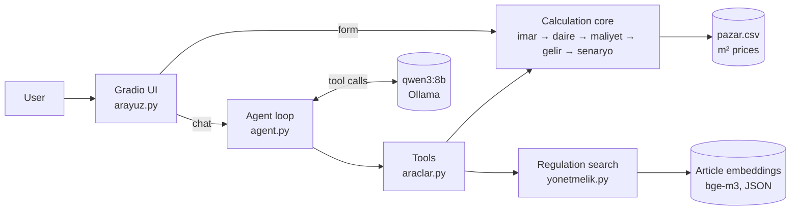

# Müteahhit Fizibilite Asistanı

[](https://github.com/kaan-svg/muteahhit-fizibilite/actions/workflows/tests.yml)

A local AI assistant for small residential construction projects in **Alanya / Antalya, Turkey**.
Given a plot and its zoning parameters, it estimates buildable area, apartment mix, construction cost,
sales revenue and the contractor's profit, and answers questions about the zoning regulation.

Everything runs locally: a tested Python calculation core, an agent on top of a local LLM
(Ollama, `qwen3:8b`) that calls the calculations as tools, and RAG over the
*Planlı Alanlar İmar Yönetmeliği* (Turkish zoning regulation).

**The LLM never does the math.** Every number comes from the calculation code; the model only
decides which tool to call and explains the result.

>  **For information only.** A learning project, not investment, legal or engineering advice.
> Prices and costs are rough public averages and assumptions. Always check the official zoning
> status (imar durumu) of a parcel and real local prices before making any decision.

## Features

- **Feasibility calculator:** zoning (TAKS, emsal, floor limit) → apartment mix → cost → revenue → profit,
  for both land purchase and *kat karşılığı* (landowner receives a share of the units).
  Areas excluded from emsal (balconies, stairs, parking; up to 30%) can be added to the cost.
- **Sensitivity analysis:** how profit changes with the landowner's share, sale price, emsal, etc.
- **Agent:** ask in plain Turkish (*"Mahmutlar'da 1000 m² arsam var... kârlı mı?"*); the model calls the tools,
  asks for missing data instead of guessing, and recovers from tool errors.
- **Regulation search (RAG):** *"Balkonlar emsale dahil mi?"* → finds the relevant articles and cites them.
- **Web UI (Gradio):** an instant calculator form and a chat tab that shows which tools were called.
- **Evaluation script:** measures the agent on 10 cases, 3 runs each.

## Example: why the details matter

1000 m² plot in Mahmutlar, TAKS 0.30, emsal 1.50, 40% of the units to the landowner, +25% extra costs:

| Areas excluded from emsal (balcony, stairs, parking) | Profit |
|---|---|
| 0% | +1.93 M TL |
| 10% | −2.01 M TL |
| 20% | −5.96 M TL |
| 30% | −9.91 M TL |

The same plot also turns from loss to profit when the landowner's share drops from 45% to 40%.
Small changes in assumptions flip the result, which is why every input is explicit and adjustable.
(Excluded areas are costed at the full unit price, which overstates their effect; see *Known limitations*.)

## Architecture


```mermaid
flowchart LR
    U[User] --> UI[Gradio UI<br/>arayuz.py]
    UI -->|form| CALC
    UI -->|chat| AG[Agent loop<br/>agent.py]
    AG <-->|tool calls| LLM[(qwen3:8b<br/>Ollama)]
    AG --> T[Tools<br/>araclar.py]
    T --> CALC[Calculation core<br/>imar → daire → maliyet → gelir → senaryo]
    T --> RAG[Regulation search<br/>yonetmelik.py]
    RAG --> IDX[(Article embeddings<br/>bge-m3, JSON)]
    CALC --> CSV[(pazar.csv<br/>m² prices)]
```

| Module | Role |
|---|---|
| `imar.py` | Footprint, total floor area, number of floors |
| `daire.py` | Net usable area, apartment mix (1+1, 2+1, 3+1) |
| `maliyet.py` | Building class + official unit construction cost |
| `gelir.py` | Sales revenue, profit (land purchase or kat karşılığı) |
| `senaryo.py` | Chains the above, compares scenarios |
| `araclar.py` | Tool definitions (JSON Schema) + argument cleaning |
| `agent.py` | Tool-calling loop with step limit and conversation memory |
| `yonetmelik.py` | Downloads the regulation, splits it into articles, embeds and searches |
| `llm.py` | Single-shot explanation of a result |
| `arayuz.py` | Gradio web interface |
| `degerlendirme.py` | Agent evaluation |

## Evaluation

`python -m src.degerlendirme --tekrar 10` runs 10 cases × 10 runs against the local model. Expected numbers
come from the calculation code, so this measures the **model's behaviour**, not the formulas
(those are covered by unit tests).

- **arac:** the right tool was called with the right arguments (the tool returned the expected profit)
- **rakam:** the number in the answer matches the tool output (±0.06 M TL, or the margin)
- **yon:** profit/loss direction stated correctly
- **madde / yasak:** the regulation answer cites the right article and doesn't contain a known wrong claim
- **sormali:** with missing TAKS/emsal, nothing is calculated with invented values and the user is asked

### Results (`qwen3:8b`, thinking off, 10 runs per case)

| Case | What it tests | Passed |
|---|---|---|
| kestel_1+1 | Only 1+1 units | 10/10 |
| tosmur_kendi_arsam | No landowner share | 10/10 |
| avsallar_buyuk | 2+1 / 3+1 mix, loss expected | 10/10 |
| duyarlilik | Two scenarios, two numbers | 10/10 |
| eksik_bilgi | TAKS / emsal missing, must ask | 10/10 |
| emsal_disi_sinir | Regulation: 30% cap, Madde 5 | 10/10 |
| mahalleler | Price list tool | 10/10 |
| mahmutlar | Basic feasibility, loss expected | 9/10 ¹ |
| oba_kat_siniri | Floor limit from the plan | 9/10 ¹ |
| balkon | Regulation: balconies, Madde 22 | **4/10** |
| **Total** | | **92/100** |

¹ one profit/loss-direction failure each, not yet checked by hand.
Average response time: 3–8 s per question on an RTX 5060 (8 GB).

### How it got there

| | Run | Total | What changed before the run |
|---|---|---|---|
| 1 | 3 runs/case | 22/30 | — (after fixing two checker bugs, see below) |
| 2 | 10 runs/case | 64/100 | Added areas excluded from emsal (new tool parameter) |
| 3 | 10 runs/case | 74/100 | Removed a leak from a tool description; code guard against invented values |
| 4 | 10 runs/case | **92/100** | Code guard for the apartment mix; article number in search results |

Each step came from reading the failed answers, not from guessing:

- **A new feature broke an old case.** After adding the excluded-area parameter, *kestel_1+1* fell from 3/3
  to 4/10 and then 0/10. The model stopped sending the apartment mix ("only 1+1"), the tool used the default
  50/50 mix, and the model still wrote "*1+1 oranı %100 olarak alınmıştır*" — claiming it had followed an
  instruction it had ignored. Fix: the guard rejects a call when the user named a unit type but no mix was
  sent, and the tool result now states which mix was used. 0/10 → 10/10.
- **The model answered from my own tool description.** The parameter description said "at most 0.30", so for
  the 30% question the model answered without searching the regulation (0.5 s answers). Removing the number
  and adding the article number to every search result: 0/10 → 10/10.
- **Prompt rules did not stop invented values; code did.** With TAKS/emsal missing the model invented them in
  every run despite the "don't guess, ask" rule. `koruma.py` now checks that every zoning value in a tool call
  actually appears in the user's messages and returns an error otherwise. The model *still tries* to invent
  values in most runs, but none reach the user: 0/10 → 10/10.
- **Still unsolved: the balcony rule (4/10).** Retrieval finds Madde 22 every time, but the model often turns
  "balconies are *not* counted in emsal under these conditions" into "*may be* counted". This is a reading
  error of the 8B model that guards in code cannot catch.
- **Three runs were not enough.** With 3 runs, the balcony and 30% cases swapped results between two runs
  (2/3 ↔ 0/3). With 10 runs the regressions above became visible.

### Fixing the evaluator first

The evaluator is code too, and it was wrong four times:
- a correct answer that gave the **margin** (−16.2%) and "*kâr elde edilememiştir*" was marked wrong;
- an answer that **invented TAKS/emsal** was not caught because the tool call happened to fail for another reason;
- "*karlı olmamaktadır*" was not recognised as a loss;
- when Ollama was not reachable, every case was scored as failed (0/30) instead of stopping.

Each was fixed with a test. Some fixes made the score *worse*, which is the point: the evaluation should
measure the model, not flatter it. Raw answers and tool arguments of every run are saved in `eval/sonuc-*.json`.

## Design decisions

- **Calculations in code, not in the LLM.** An 8B model reads numbers correctly but misreads their
  relationships (in early tests it compared costs with gross revenue instead of the contractor's share).
  The prompt now states the profit formula explicitly, and all arithmetic stays in tested code.
- **Guards in code, not rules in the prompt.** `koruma.py` rejects tool calls whose zoning values or
  apartment mix don't come from the user. Prompt rules alone did not stop invented values (see Evaluation).
- **Argument cleaning instead of prompt rules.** Small models send `45`, `"%45"` or `0.45` for the same
  ratio, `TAKS` instead of `taks`, and fill unknown fields with `0`. These are normalised in code;
  invalid calls return `{"hata": ...}` so the model can retry instead of crashing the loop.
- **No vector database.** The regulation is ~230 chunks. A JSON file with normalised vectors and a
  plain cosine search is enough; Chroma would only add a dependency.
- **Hybrid search.** 80% embedding similarity + 20% keyword overlap, so exact terms like *bodrum* or
  *otopark* are not missed. `bge-m3` is used because it is multilingual.
- **Thinking mode off.** `qwen3` reasons before every tool call by default, which made each step
  5–10× slower without improving tool selection.

## Data and assumptions

| Input | Source | Reliability |
|---|---|---|
| Unit construction cost | Ministry of Environment 2026 table (Resmî Gazete, 3 Feb 2026, No. 33157) | Official, not market cost: excludes VAT, includes 15% overhead + 10% contractor profit |
| m² sale prices (`data/pazar.csv`) | Emlakjet listing averages, Sep 2026 | Asking prices, include older buildings |
| Apartment sizes (60 / 95 / 130 m²), common area 15% | Assumption | To be replaced with local data |
| Regulation text | mevzuat.gov.tr (downloaded at setup, current version) | Official |

## Known limitations

- **Areas excluded from emsal are costed at the full unit price.** Balconies, stairs and parking
  (`emsal_disi_orani`, 0–30% per Madde 5) are added to the cost at the same TL/m² as interior space.
  In reality open balconies and parking are cheaper to build, so this overstates their cost; a separate
  unit cost for these areas would be more accurate. They are not added to the sellable area.
- **Regulation answers are the weakest part** (balcony question 4/10 in the evaluation). Retrieval finds the right articles,
  but the 8B model sometimes mixes articles or inverts a rule. Treat regulation answers as pointers to the
  article, not as legal answers. Parcel-specific plan notes always override the general regulation.
- **The model still tries to invent missing zoning values**; `koruma.py` blocks these calls, but it only
  checks that a number appears in the user's messages, not which field it belongs to.
- **PDF extraction artefacts.** `pypdf` splits some words (*"k onut"*); search still works but text is imperfect.
- Financing cost, time to sell, basements and setbacks are not modelled.

## Setup

Requirements: Python 3.11+, [Ollama](https://ollama.com), ~8 GB VRAM recommended (tested on RTX 5060 8 GB, WSL2).

```bash
git clone https://github.com/kaan-svg/muteahhit-fizibilite.git
cd muteahhit-fizibilite
python3 -m venv .venv && source .venv/bin/activate
pip install -r requirements.txt
pytest

ollama pull qwen3:8b
ollama pull bge-m3
python -m src.yonetmelik kur      # download regulation + build search index (once)

python -m src.arayuz              # web UI at http://localhost:7860
python -m src.agent               # or chat in the terminal
```

If Ollama runs on Windows and the code in WSL, enable mirrored networking
(`[wsl2] networkingMode=mirrored` in `%UserProfile%\.wslconfig`) so `localhost:11434` is reachable.

## Glossary

| Term | Meaning |
|---|---|
| TAKS | Footprint / plot area |
| Emsal (KAKS) | Total floor area / plot area |
| Kat karşılığı | Landowner provides the plot and receives a share of the finished units instead of cash |
| Yapı sınıfı (III-A … IV-B) | Building class used for the official unit construction cost |

## Roadmap

- [x] Calculation core with tests
- [x] Local LLM, tools, agent loop
- [x] RAG over the zoning regulation
- [x] Gradio UI
- [x] Evaluation script
- [x] Code-level guard: refuse calculation when TAKS/emsal were not given by the user
- [x] Areas excluded from emsal added to cost (balconies, stairs, parking)
- [ ] Separate, lower unit cost for excluded areas
- [x] More runs per case (10+) for stable regulation scores
- [ ] Try a larger model (needs more than 8 GB VRAM)
- [ ] Real Alanya prices, unit sizes and construction costs from local sources
- [ ] Compare with a real completed project
